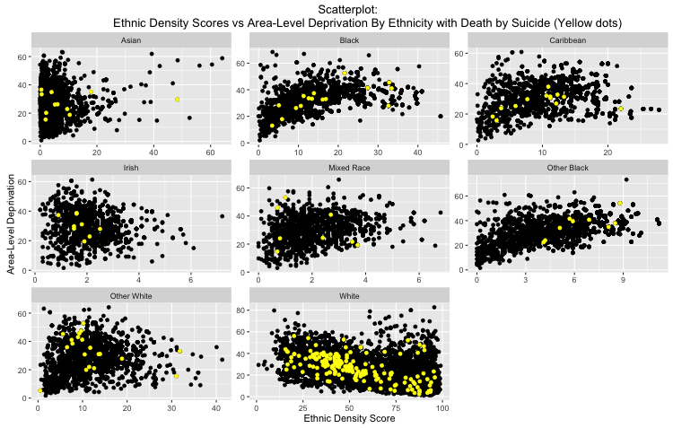
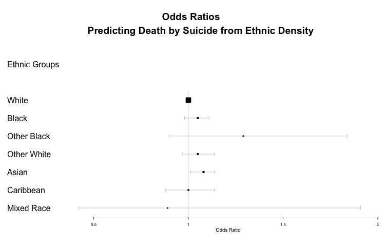
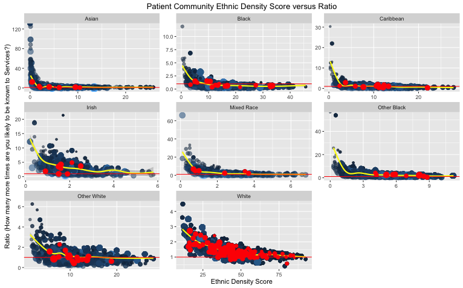

```{r Loading_libraries_and_data, results="hide", echo=FALSE}
#Cleaning history/restart, installing packages, setting up wd and loading data. 

rm(list=ls())
gc()


suppressPackageStartupMessages(library(foreign))
suppressPackageStartupMessages(library(lubridate))
suppressPackageStartupMessages(library(tidyr))
#devtools::install_github("hadley/plyr")
suppressPackageStartupMessages(library(dplyr))
suppressPackageStartupMessages(library(ggplot2))
suppressPackageStartupMessages(library(gmodels))
suppressPackageStartupMessages(library(GGally))
suppressPackageStartupMessages(library(gridExtra))
suppressPackageStartupMessages(library(knitr))
suppressPackageStartupMessages(library(grid))
suppressPackageStartupMessages(library(GGally))
suppressPackageStartupMessages(library(Amelia))
suppressPackageStartupMessages(library(caret))

# setting working directory
setwd("/Users/andreafernandes/Capstone_Project_Submission/1_ACFernandes.Capstone_Project_DataStory/")
```

******

## The Data Story

******

### The main question

The __main question__ investigated in this project was: how does ethnic density effect death by suicide in a mental health care setting?

What is the ethnic density effect? Ethnic density is defined as the composition of each ethnic group residing in a geographical area of a given size (usually a fairly large geographical area, known as Lower Super Output Area (LSOA) which consists of around 1500 residents). 

There is some evidence suggesting a protective effect of ethnic density on suicide related behaviours among individuals without a psychiatric illness. Given that individuals WITH a psychiatric illness are at higher risk of suicide, does this protective association hold true among individuals with a psychiatric illness?

### Brief glimpse of the data

Below is a comparison table showing the number of patients in our entire cohort and within each diagnosis group and by those who died by suicide:

|Diagnosis*         |     N|Number of Suicides|   
|:--                |-----:|              ---:|   
|__Schizophrenia__  |      |                  |
|No                 | 38091| 190              |    
|Yes                |  9438|  72              |    
|__Schizoaffective__|      |                  |    
|No                 | 46199| 252              |    
|Yes                |  1330|  10              |    
|__Bipolar__        |      |                  | 
|No                 | 42197| 216              |    
|Yes                |  5332|  46              |    
|__Substance Abuse__|      |                  |   
|No                 | 30030| 169              |   
|Yes                | 17499|  93              |   
|__Depressive__     |      |                  |   
|No                 | 27023| 152              |
|Yes                | 20506| 110              |
|__Manic Disorder__ |      |                  |
|No                 | 45487| 251              |
|Yes                |  2042|  11              |
|                   |      |                  |
|__Total__          |47267 | 262              | 

* The groups are not mutually exclusive. Some patients have more than one diagnoses and hence are counted twice. 

* A note to make from the table below how dying by suicide is an extremely rare event and this introduces a potential to over-estimate results


### Exploring Ethnic Density and Suicide

The association of Suicide with ethnic density was explored in exploratory data analysis. Here is a visual of the relationship between ethnic density scores, area-level deprivation and suicide. 





The lack of obvious patterns in deaths by suicide is reflected in the analysis, both in a balanced and unbalanced dataset.

### Exploring Ethnic Density and Suicide: Results from the logistic regression analyses

******

The forest plot below shows results of logistic regression (adjusted for gender, age, marital status, deprivation and borough) conducted by ethnic group (using the unbalanced dataset). The odds ratios all show no association of ethnic density with death by suicide (apart from the Asian group).



******

The following table shows results from predictive analysis of a balanced dataset. While the sensitivity and specificity are good for some ethnic groups, the positive predictive values are poor across all ethnic groups, this means that suicides over-predicted. 

|Ethnic Group  | Sensitivity |Specificity  | Positive Predictive Value|
|:--           |:-----------:|:-----------:|:------------------------:| 
|Other Black | 0.89  |   0.74    | 0.01   |
|Other White | 0.55  |   0.72    | 0.01   |
|Mixed Race  | 0.75  |   0.64    | 0.02   |
|Caribbean   | 0.46  |   0.65    | 0.007  |
|Asian       | 0.54  |   0.74    | 0.01   |
|Black       | 0.75  |   0.70    | 0.02   |
|White       | 0.37  |   0.76    | 0.01   |


******

### ___Ethnic Density and Suicide___ - Conclusion: Ethnic density is not a predictor of death by suicide in this clinical cohort. 

******

### New revelations of the data: Trust Ethnic Density versus Community Ethnic Density. 

During exploratory data analysis, the relationship between trust ethnic density and population ethnic density was uncovered. It turned out that an increase in ethnic density in the population did not mean a proportionate reflection in mental health services. In fact, individuals living in areas where there were very few of their own ethnic residents, were most likely to be known to mental health services (see plot below). 





This pattern of being known to mental health services as population ethnic density decreases was replicated across all ethnic groups. The results suggests that there could an ethnic density effect and that the lower this effect the higher the chances of experiencing mental health issues. On investigating the association among the White British and Asian ethnic groups, show that the association between ratio and ethnic density score is very weak but significant. Further research will be required to explore this association in more detail.  

******

## Order and Description of HTML and Rmd files 

These are in order: Introduction, data cleaning, data exploration, analysis (in two parts)

******

|.html File Name        | Brief Description |   
|:---------------------|:------------------|
| **ACFernandes.Capstone_Project_Introduction.html** | This file introduces the concept of the ethnic density effect, how to measure it, introduces some results from the literature, introduces the cohort and dataset and states the current aims of this project. |
| **ACFernandes.Capstone_Project_Data_Cleaning.html** | The raw data (named `ed`) has been cleaned (and renamed `edclean`). The code can be found here **ACFernandes.Capstone_Project_Data_Cleaning.Rmd** |
| **ACFernandes.Capstone_Project_Data_Exploration.html** | The cleaned data has been explored and saved for further analysis. This file explores visually the association between ethnic density and death by suicide, with which we can form a hypothesis to test. It also unveils a potential demonstration of "the ethnic density effect" by comparing ethnic density of the community to ethnic density within the trust. The code can be found here **ACFernandes.Capstone_Project_Data_Exploration.Rmd**|
| **ACFernandes.Capstone_Project_Data_Analysis.html** | This file explores the association between death by suicide and ethnic density scores. The data anaysis code can be found here: **ACFernandes.Capstone_Project_Data_Analysis.Rmd**  |
| **ACFernandes.Capstone_Project_Data_Analysis_Part2.html** | This file explores the association between trust ethnic density and community ethnic density scores. The data anaysis code can be found here: **ACFernandes.Capstone_Project_Data_Analysis_Part2.Rmd** |
