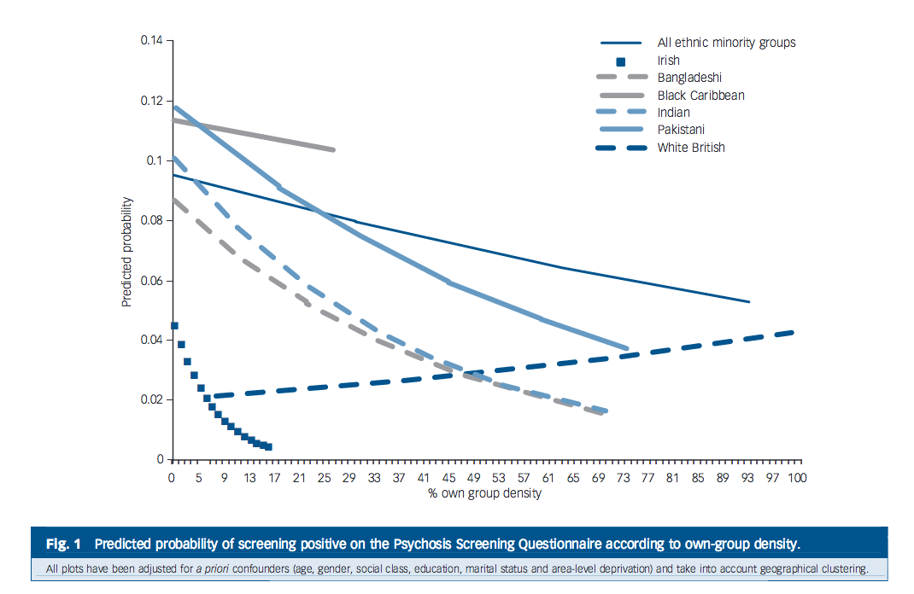

# Using Ethnic Density Scores to Predict Health Outcomes in a Mental Health Care Setting
Andrea Fernandes <andrea.c.fernandes1@gmail.com>  
22 June 2016  

******

### Introduction 

******

#### What is Ethnic Density?

Ethnic density is defined as the composition of each ethnic group residing 
in a geographical area of a given size (usually a fairly large geographical area,
known as Lower Super Output Area (LSOA) which consists of around 1500 residents). 

Here's an image of London showing the ethnic density or ethnic composition of 
the city:

******

In the image above, the White British ethnic density is very high
(indicated by the dominant dark green colour) across the city but especially in 
the outskirts of central London. There are pockets of high Asian ethnic 
density (dark blue), in the East and West of London. Non-British White ethnic
groups (yellow) and Black ethnic groups (pink) have a reasonably high ethnic 
density in and around central London. 

The ethnic densities vary across London, and different ethnic groups are 
dominant across different parts of London. 

******

__Measuring ethnic density using the ethnic density score__

Based on where one lives and their ethnicity, every individual can be assigned 
with an _ethnic density score_. This score is simply the own ethnic groups 
(or own-group) ethnic density in the area they live in. 

__Calculating ethnic density score:__

      A residential area - "Area A" - has a total of 1500 residents.
      
      The ethnic composition in Area A is: 
          500 residents of Indian descent, 
          250 residents of British descent and 
          750 residents of African descent.
          
      The Indian Ethnic Density would be 500 divided by the total number of 
      residents 1500 (0.33). 
      That is, 33% of all individuals in this area are of Indian descent.
      
      The British Ethnic Density would be 250 / 1500 (0.166). 
      
      The African Ethnic Density would be 750 / 1500 (0.50). 
      
      For Someone of Chinese descent who moves in to Area A, their ethnic density 
      score would be 1 divided by 1500 = ~0.00. Which indicates they live in an 
      area of low own-group ethnic density. 
      
      Someone of African descent would have an ethnic density of 50%. The African 
      person is livinig in an area of __high ethnic density__ (because there are
      more of this ethnic group in Area A, relative to any other ethnic groups). 

The ethnic density of a person hence is indicative of the type of area they live
in, in terms of their ethnic composition. So whether they live in _high ethnic 
density area_, which is where there are more individuals of their own ethnicity 
or _low ethnic density area_, which is more individuals of another ethnicity in 
their residential area. 

******

#### Why is Ethnic Density important?

******

Some studies are reporting that, in a multicultural cities, ethnic minorities 
living in areas where there are higher proportions of ethnic minority ethnicity 
may be better off (but in some cases worse) in terms of their mental and physical
health relative to ethnic minority groups living in areas with larger 
proportions of the host ethnicity. This, beneficial effect on health by virtue 
of the ethnic composition in their residential area, is known as the ethnic density effect.

The figure below is an example suggesting the reporting levels of 
psychotic symptoms on relevant measures decreases among individuals living in 
areas of higher own-group ethnic density. 

******

Another example (Figure below), of the ethnic density effect in play in a majority of the 
ethnicities presented below. There seems to be a reverse effect in White British
ethnic group.

******

The figure above shows that the ethnic density effect may not manifest consistently among all ethnic groups, but there is evidence of a protective effect against mental health outcomes in most ethnic groups. 

******

**Studies demonstrating the positive Ethnic Density Effect on Mental Health**

This ethnic density "effect" was first reported in 1939 a study by Faris and 
Dunham. Their study based in Chicago showed that White people, living in areas 
where Black ethnic groups were predominant, had a higher rate of schizophrenia 
(137.4 cases per 100,000), compared to the Black residents (39.4 cases per 100,000), 
where the overall area prevalence rate for schizophrenia was 50.4 cases per 100,000. 
In another study, Halpern and Nazroo used a nationwide community survey in England 
and Wales to explore the association of ethnic density and reported on levels 
of psychiatric symptoms. They showed a negative correlation of own-group ethnic 
density with neurotic symptoms, such as fatigue, sleep, depression and anxiety, 
(r = -0.087). That is, with a increase in ethnic density, there is a decrease 
in the levels of neurotic symptoms. Similarly, they found a negative association 
of ethnic density with psychotic symptoms (r = -0.113). 

**Studies demonstrating the a complex mechanism of the effect**

Varying degrees of the effects of ethnic density (own-group or combined ethnic 
minority) on physical and mental health demonstrated positive effects of ethnic 
density on health outcomes but also detrimental effects in some ethnicities and 
not others. For example, among Black groups this association is largely reversed 
with increased risk of premature and all-cause mortality among Black groups with 
increasing Black ethnic density. The mechanism of the ethnic density effect is 
complex and requires a deeper understanding of ethnic groups and cultures. 

**Ethnic Density Effect and Suicidality**

There is some evidence of the ethnic density effect being protective, for ethnic
minority groups in the community, against suicide-related behaviours. In 2012, a
review was published summarising the effect of ethnic density on mental health 
outcomes, which included suicide-related behaviours (2 studies) [Shaw et al, 2012]. 
Both studies found reduced risk of self-harm behaviour and completed suicide 
among ethnic minority groups with increasing ethnic density. 

In one study, the rates of A&E attendance for self-harm were compared among White,
African-Caribbean and Asian groups. They found that, as the ethnic minority 
densities increased, the self-harm referral rates of ethnic minorities fell 
relative to White self-harm referral rate with a risk ratio (RR) of 1.24 (95% CI: 0.69 – 2.10) 
in lower ethnic minority density versus an RR of 0.61 (0.47 – 0.79) in higher 
ethnic minority density areas. 

In the other study, Neeleman used coroner’s records for completed suicide data 
to determine subjects’ ethnicity background to generate White and non-White 
ethnic density for each subject. They found that, as ethnic minority density 
increased, suicide rates were higher among the White ethnic group with an RR of 
1.18 (1.02 – 1.37) and lower among ethnic minority groups RR of 0.75 (0.59 – 0.96).
      
******

### Aim

******

Individuals diagnosed with certain mental disorders seen in secondary mental health
care have a particularly high risk of suicide mortality compared to the general 
population. Whether the ethnic density effect has any impact on this risk is not
clear. 

The aim is to determine if there is an association of ethnic density with completed suicide
in this secondary mental health care setting. In other words, this project will 
aim to study whether living in an area of high or low ethnic density (i.e. 
surrounded more by people of the same ethnicity or not) has any effect 
on completed suicide, in mental illness. 

******

### The Data

******

#### Data source

The data is derived from a mental health clinical trust in South London and 
provides mental healthcare for an area with a population of around 1.4 million 
residents, to individuals, who are referred by GPs, privately referred, A&E and 
self-referrals, seeking treatment for mild to severe mental health problems. 

The trust uses electronic system to record day-to-day patient interactions 
(medical, demographic, clinical intervention etc) in either structured notes or 
free-text fields. 

In 2008, a research facility was founded which used this a pseudonymised version
of this electronic system from the South London trust for research and clinical 
audit purposes. Currently there are ~270000 records in this research database. 
For this project, a subset of patients, and related variables, were extracted 
based on an inclusion criteria (see below) to create the dataset for this project.

******

#### The Cohort

The dataset consists of 47851 patients.

The patients in the dataset were included if they met the following inclusion criteria: 

1) They had an active referral (in the form of face to face contact) at any point
between the observation window of 1st of January 2008 and 31st of December 2014. 

2) They had a clinical diagnosis of depression, schizophrenia, schizoaffective, 
bipolar disorder, manic disorder and alcohol abuse. For patients with multiple 
diagnoses, the date of diagnosis closest to the observation start date was 
selected. 

3) They had an area-level address (LSOA code) recorded (to merge with census data). 
For patients with multiple area-level addresses, the closest address to the date
of diagnosis was selected. 

4) They had a known ethnicity recorded (each patients' ethnicity and ethnic 
composition in their LSOA was used to assign an ethnic density score) . 

#### Diagnoses 

Each individual in the cohort is diagnosed with one or more of the disorders 
mentioned in the table below. 

|Diagnosis          |     N|Number of Suicides|   
|:--                |-----:|              ---:|   
|__Schizophrenia__  |      |                  |
|No                 | 38091| 190              |    
|Yes                |  9438|  72              |    
|__Schizoaffective__|      |                  |    
|No                 | 46199| 252              |    
|Yes                |  1330|  10              |    
|__Bipolar__        |      |                  | 
|No                 | 42197| 216              |    
|Yes                |  5332|  46              |    
|__Substance Abuse__|      |                  |   
|No                 | 30030| 169              |   
|Yes                | 17499|  93              |   
|__Depressive__     |      |                  |   
|No                 | 27023| 152              |
|Yes                | 20506| 110              |
|__Manic Disorder__ |      |                  |
|No                 | 45487| 251              |
|Yes                |  2042|  11              |

******

#### Data notes

Suicide is rare event and there are far more patients who do not die by suicide compared to those do in this mental health setting. This means analysing the data will require taking this unbalance into account in order to study the association of ethnic density with death by suicide with biases.

The next file is a run through of the data cleaning process. The resulting dataset is used for exploration and analysis. 

******

