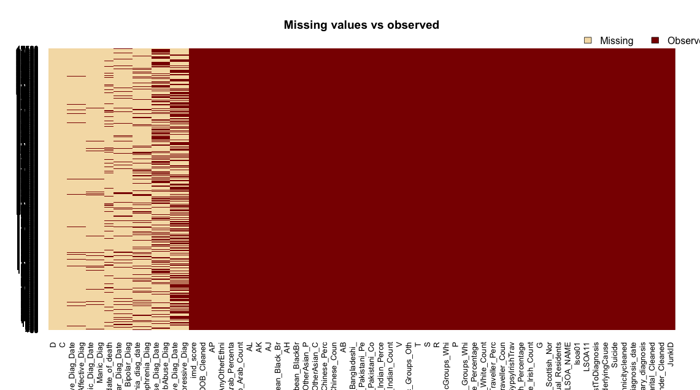

```{r Loading_libraries_and_data, results="hide", echo=FALSE}
#Cleaning history/restart, installing packages, setting up wd and loading data. 

rm(list=ls())
gc()


suppressPackageStartupMessages(library(foreign))
suppressPackageStartupMessages(library(lubridate))
suppressPackageStartupMessages(library(tidyr))
#devtools::install_github("hadley/plyr")
suppressPackageStartupMessages(library(dplyr))
suppressPackageStartupMessages(library(ggplot2))
suppressPackageStartupMessages(library(gmodels))
suppressPackageStartupMessages(library(GGally))
suppressPackageStartupMessages(library(gridExtra))
suppressPackageStartupMessages(library(knitr))
suppressPackageStartupMessages(library(grid))
suppressPackageStartupMessages(library(GGally))
suppressPackageStartupMessages(library(Amelia))
suppressPackageStartupMessages(library(caret))

# setting working directory
setwd("/Users/andreafernandes/Capstone_Project_Submission/3_ACFernandes.Capstone_Project_Data_Cleaning/")

# get raw data
ed <- read.dta("/Users/andreafernandes/Desktop/Google Drive/Springboard_Data_Science_Course_2016/RLearning_Springboard_ProjectED/R_Springboard/Raw_Data/For_Excel.dta")
```

******

#### Cleaning the Data

******

Introductory note

      The aim of this file is to generate a cleaned dataset. 
      
      This file explains the variables available in the raw data set, the
      cleaning process, the variables that will be needed for analysis and
      the generation of new features/variables (feature engineering) and
      provides a data dictionary of all the variables in the cleaned dataset. 
      
      The end product of the following code generates a new dataset named
      `edclean`. This is data used for exploration of trends in the association
      of ethnic density with death by suicide. 
      
      The Data Dictionary is provided in this file. 

******

#### Description of the raw (`ed`) dataset

******

```{r structure_of_ed_data, echo = FALSE, results = "hide", warning = FALSE}
str(ed)
```


The `str(ed)` output (not shown) shows that this raw dataset `ed` contains data or variables that can be sectioned into categories:

  - the patient demographics,      
  - ethnic density score (which is the main exposure variable),      
  - suicide variable (the main outcome variable), and        
  - other variables (e.g. ethnic density scores and numbers), which may be          confounding variables or redundant.      

In addition,

  - there are 47581 observations (i.e. patients) and 67 variables,   
  - lots of NA values (see screenshot below),    
  - inexplicable column headings,   
  - redundant variables,    
  - potentially duplicate variables and    
  - several continuous and categorical data variables, that may or may not 
    contain the same data or need to be manipulated for more utility,   
  - not all the 67 variables are infomative or useful    

```{r Missing_data_map_unprocessed_data, echo = FALSE, results = "hide", fig.width=15, fig.height=15, cache = TRUE, eval=FALSE}
#missmap(ed, main = "Missing values vs observed") 
# [ref] save this image and link it back in using 
```

******

Here's a missing map image displaying all the observations and variables in the raw `ed` dataset. The missing values are color coded (red for values, non-red for missing values). 



******

Details of the data cleaning required on the raw (`ed`) dataset


| Variable Name      | Notes                                          |  
|:-------------------|:-----------------------------------------------|  
| JunkID            | can be deleted, redundant |  
| Gender_Cleaned    | There are 2 "empty" Gender cells. Will replace them with NA |  
| DOB_Cleaned       | one NA value in row 45501, not sure what to do with it, will leave until further analysis |  
| Marital_Cleaned   | 3803 blank values, no NA values. 3803 blank values assigned to NA |  
| primary_diagnosis | can be deleted, redundant. lots of different diagnosis in unstructured and structured format. and is potentially redundant because there are other variables that are flag variables for the main diagnoses. Diagnosis and diagnosis date columns contain more than 50% NA values. The NA values imply patients who are not diagnosed with the particular disorder. Will replace NA with 0.   |  
| ethnicitycleaned  | is fine, no NA or blank values |  
| imd_score         | 49 NA values, not sure what to do here. will leave it in until further anlysis. |  
| diagnosis_date to Bipolar_Diag_Date | these variables are dates of the main diagnoses and binary flag variables for diagnoses, NA in these variables means patient does not have the disorder. So perhaps better to change it to 0 instead. |  
| ons_date_of_death      | 5310 deaths in the cohort|  
| Suicide                | 263 suicides in the cohort|  
| ICD10_UnderlyingCause  | redundant variable, delete|  
| LSOAClosestToDiagnosis | LSOA area level address code|  
| LSOA11                 | redundant, delete|  
| lsoa01                 | redundant, delete|  
| LSOA_NAME              | name of boroughs |  
| C and D                | are empty delete|  
| All_Usual_Residents to  AP | variable names are not informative and need to be renamed. These variables are ethnic density (number and percentage of people of different ethnic groups in the corresponding LSOA code) will be needed to generate the main exposure variable "ethnicdensityscore". Some variables with variables names not decipherable and need renaming (e.g. "AL" = OtherBlack_EDPercent). Original names available from original Stata database (not shown). The exposure variable "ethnic density scores" will need to generated using the available columns in the dataset.     |  

  
******

#### Code to Clean the Data

******

Cleaning the Gender variable 
```{r processing_data_gender, echo = TRUE, results = "hide"}

# tabulating the data to check columns
table(ed$Gender_Cleaned) 

# tabulating the data to check NA values
table(is.na(ed$Gender_Cleaned)) 

# no NA values, 2 blank ("") values. 

#       Female   Male 
#     2  23106  24473 

#recoding blank gender values as NA
ed$Gender_Cleaned[ed$Gender_Cleaned == ""] <- NA
table(ed$Gender_Cleaned) 
table(is.na(ed$Gender_Cleaned))

#identify where gender NA rows are
which(is.na(ed$Gender_Cleaned)) # row 682 and 30844
samples_to_remove <- which(is.na(ed$Gender_Cleaned)) # row 682 and 30844

#removing samples from original data "ed"
# overwriting ed with new ed.
ed <- ed[-samples_to_remove, ]

table(is.na(ed$Gender_Cleaned))
table(ed$Gender_Cleaned)
#       Female   Male 
#        23106  24473

```

******

Cleaning the Marital Status variable 
```{r processing_data_marital, echo = TRUE, results = "hide"}

# tabulating data
table(ed$Marital_Cleaned) # 3803 blank ("") values.
table(is.na(ed$Marital_Cleaned)) # no NA values

# replacing blank values in Marital_Cleaned variable with "Unknown"
ed$Marital_Cleaned[ed$Marital_Cleaned == ""] <- "Unknown"

table(ed$Marital_Cleaned) # New category name is "Unknown" = 3803
```


*******

Cleaning the Diagnoses columns 
```{r processing_data_diagnosis, echo = TRUE, results = "hide"}
# replacing NAs with 0 in the diagnosis columns
ed$Schizophrenia_Diag[is.na(ed$Schizophrenia_Diag)] <- 0
ed$SchizoAffective_Diag[is.na(ed$SchizoAffective_Diag)] <- 0
ed$Bipolar_Diag[is.na(ed$Bipolar_Diag)] <- 0
ed$Depressive_Diag[is.na(ed$Depressive_Diag)] <- 0
ed$Manic_Diag[is.na(ed$Manic_Diag)] <- 0
ed$SubAbuse_Diag[is.na(ed$SubAbuse_Diag)] <- 0
```


******

Renaming and deleting redundant variables
```{r processing_data_renaming, echo = TRUE, results = "hide"}
#renaming columns 

ed <- ed %>% rename(TotalResidentsInLSOA = All_Usual_Residents,
                       WhiteBrit_EDPercent  = G, 
                       WhiteIrish_EDPercent = White_Irish_Percentage, 
                       OtherWhite_EDPercent = White_Other_White_GypsyIrishTrav, 
                       WhiteBlackCarib_EDPercent = P, 
                       WhiteBlackAfri_EDPercent = R, 
                       WhiteAsian_EDPercent = T, 
                       OtherMixed_EDPercent = V, 
                       BritIndian_EDPercent = Asian_Asian_British_Indian_Perce, 
                       BritPakistani_EDPercent = Asian_Asian_British_Pakistani_Pe, 
                       BritBangladeshi_EDPercent = AB, 
                       BritChinese_EDPercent = Asian_Asian_British_Chinese_Perc,
                       OtherAsian_EDPercent = Asian_Asian_British_OtherAsian_P, 
                       African_EDPercent = AH, 
                       Caribbean_EDPercent =  AJ, 
                       OtherBlack_EDPercent = AL, 
                       WhiteBrit_Residents = White_English_Welsh_Scottish_Nor, 
                       TotalIrish_Residents = White_Irish_Count, 
                       OtherWhite_Residents = White_Gypsy_Irish_Traveller_Coun, 
                       MixedCaribbean_Residents = Mixed_Multiple_Ethnic_Groups_Whi, 
                       MixedAsian_Residents = S, 
                       OtherMixed_Residents = Mixed_Multiple_Ethnic_Groups_Oth, 
                       BritIndian_Residents = Asian_Asian_British_Indian_Count, 
                       BritPakistani_Residents = Asian_Asian_British_Pakistani_Co, 
                       BritBangladeshi_Residents = Asian_Asian_British_Bangladeshi_, 
                       BritChinese_Residents = Asian_Asian_British_Chinese_Coun, 
                       OtherAsian_Residents = Asian_Asian_British_OtherAsian_C, 
                       African_Residents = Black_African_Caribbean_BlackBr, 
                       Caribbean_Residents = Black_African_Caribbean_Black_Br, 
                       OtherBlack_Residents = AK, 
                       OtherEthnicity_Residents = Other_Ethnic_Group_AnyOtherEthni) 
```

******

Cleaning Area-level deprivation score (imd_score)
```{r data_cleaning_deprivation_score, echo = TRUE, results = "hide"}
table(is.na(ed$imd_score)) #49 NA values. To remove

#identifying and assigning deprivation score NA values to "sample to remove"
sample_to_remove <- which(is.na(ed$imd_score))

ed <- ed[-sample_to_remove, ]

table(is.na(ed$imd_score)) # no NA values

# removed 49 rows from entire dataset (these had missing imd_score values)


# save
save(ed, file = "Cleaned_Data_ED.Rdata", compress = TRUE)
```

******

```{r columns to delete, echo = TRUE, results = "hide", warning = FALSE, message = FALSE, error = FALSE}
# Columns to delete because they are redundant or empty

# C and D  
# lsoa01 
# ICD10_UnderlyingCause 
# primary_diagnosis
# JunkID    


# total dimensions of raw dataset
# dim(ed) # 47530    67

ed <- ed %>% select(-C, -D, -lsoa01, -ICD10_UnderlyingCause, 
                    -primary_diagnosis, -JunkID)

# total dimensions of cleaned dataset
# dim(ed) # 47530    61
```

******

Cleaned data saved as "Cleaned_Data_ED.Rdata". This contains dataframe `ed`.

```{r saving_processed_data}
# save ed 
save(ed, file = "Cleaned_Data_ED.Rdata", compress = TRUE)
```

******

### Feature Engineering 

******

List of new features added:

- The main exposure variable: Ethnic Density Score (named "ethnicdensityscore")  
      
- Ethnicity (named "ethnicity")  
  
- Age variables (named "ageatdiagnosis", "ageatdeath" and "agegroups") - 
Age at Diagnosis", "Age at Death" and "Age Group"  
      
- Borough variable (named "LSOA_4boroughs"): Croydon, Lewisham, Southwark, 
Lambeth and Other
      
- Cause of Death Variable (named "DeathBy")

Below is the code used to generate the listed new features. 

******

__Ethnic Density Score (named "ethnicdensityscore")__
```{r feature_engineering_ethnicdensityscore, echo = TRUE, results = "hide"}
rm(list=ls())
load("Cleaned_Data_ED.Rdata")

# 
#       - The main exposure variable of the dataset is Ethnic Density (ED) score.
#         Ethnic density is defined as the composition of each ethnic group
#         residing in a geographical area of a given size (usually a fairly large
#         geographical area, known as Lower Super Output Area (LSOA) which
#         consists of around 1500 residents).
#       
#       - Since, in the original dataset `ed`, each patient was already assigned 
#         to ethnic density  (for every ethnic group) based on their LSOA code, 
#         to assign OWN ethnicity ethnic density score to each individual, the
#         relevant ethnic density score based on patient ethnicity was selected
#         and assigned to each patient.

# Code generating an ethnic density score for each patient

edclean <- ed %>% 
  mutate(ethnicdensityscore = 
          ifelse(ethnicitycleaned == "British (A)", WhiteBrit_EDPercent, 
          ifelse(ethnicitycleaned == "African (N)", African_EDPercent, 
          ifelse(ethnicitycleaned == "Irish (B)", WhiteIrish_EDPercent, 
          ifelse(ethnicitycleaned == "Any other Asian background (L)", OtherAsian_EDPercent, 
          ifelse(ethnicitycleaned == "Any other black background (P)", OtherBlack_EDPercent,
          ifelse(ethnicitycleaned == "Any other mixed background (G)", OtherMixed_EDPercent,
          ifelse(ethnicitycleaned == "Any other white background (C)", OtherWhite_EDPercent,
          ifelse(ethnicitycleaned == "Bangladeshi (K)", BritBangladeshi_EDPercent,
          ifelse(ethnicitycleaned == "Caribbean (M)", Caribbean_EDPercent,
          ifelse(ethnicitycleaned == "Chinese (R)", BritChinese_EDPercent,
          ifelse(ethnicitycleaned == "Indian (H)", BritIndian_EDPercent,
          ifelse(ethnicitycleaned == "Pakistani (J)", BritPakistani_EDPercent,
          ifelse(ethnicitycleaned == "White and Asian (F)", WhiteAsian_EDPercent,
          ifelse(ethnicitycleaned == "White and Black African (E)", WhiteBlackAfri_EDPercent,
          ifelse(ethnicitycleaned == "White and black Caribbean (D)", WhiteBlackCarib_EDPercent,  
          " " )))))))))))))))) %>% 
  mutate(ethnicdensityscore = as.numeric(ethnicdensityscore)) 

# save ed with new feature into new dataset "edclean"
save(edclean, file = "Data_ED_new_features.Rdata", compress = TRUE)
```

```{r eddistributions, echo = FALSE}
# Ethnic Density Distributions

#|ethnicitycleaned               | mean(ethnicdensityscore)| median(ethnicdensityscore)|
#|:------------------------------|------------------------:|--------------------------:|
#|African (N)                    |                15.217066|                       13.3|
#|Any other Asian background (L) |                 5.236218|                        4.0|
#|Any other black background (P) |                 4.817956|                        4.9|
#|Any other mixed background (G) |                 1.868525|                        1.9|
#|Any other white background (C) |                12.387958|                       12.0|
#|Bangladeshi (K)                |                 3.375758|                        1.2|
#|British (A)                    |                49.941693|                       46.9|
#|Caribbean (M)                  |                10.775644|                       10.6|
#|Chinese (R)                    |                 2.735937|                        2.1|
#|Indian (H)                     |                 6.291938|                        4.0|
#|Irish (B)                      |                 2.076962|                        2.0|
#|Pakistani (J)                  |                 4.345593|                        2.2|
#|White and Asian (F)            |                 1.294690|                        1.2|
#|White and Black African (E)    |                 1.229189|                        1.2|
#|White and black Caribbean (D)  |                 2.718768|                        2.7|
```


*******

__Ethnicity variable (named "ethnicity")__ 

      Some of the ethnic groups are too small in numbers, these groups 
      will be aggregated while still maintaining their own-ethnic group ethnic 
      density scores and their respective suicide numbers also 
      decrease (data not shown), which make it difficult to analyse and could 
      potentially bias estimates towards ethnic groups that have larger sizes. 
      
      Grouping ethnic groups into larger ethnic categories (White, Other White,
      Irish, Black, Other Black, Caribbean, Asian and Mixed Race).

      
```{r feature_engineering_ethnicity, echo = TRUE, results = "hide"}

#Create broader groups of ethnicity (a new __"ethnicity"__ variable). 
edclean <- edclean %>% 
  mutate(ethnicity = 
          ifelse(ethnicitycleaned == "British (A)", "White",
          ifelse(ethnicitycleaned == "African (N)", "Black", 
          ifelse(ethnicitycleaned == "Irish (B)", "Irish", 
          ifelse(ethnicitycleaned == "Any other Asian background (L)", "Asian", 
          ifelse(ethnicitycleaned == "Any other black background (P)", "Other Black",
          ifelse(ethnicitycleaned == "Any other mixed background (G)", "Mixed Race",
          ifelse(ethnicitycleaned == "Any other white background (C)", "Other White",
          ifelse(ethnicitycleaned == "Bangladeshi (K)", "Asian", 
          ifelse(ethnicitycleaned == "Caribbean (M)", "Caribbean",
          ifelse(ethnicitycleaned == "Chinese (R)", "Asian",
          ifelse(ethnicitycleaned == "Indian (H)", "Asian",
          ifelse(ethnicitycleaned == "Pakistani (J)", "Asian",
          ifelse(ethnicitycleaned == "White and Asian (F)", "Mixed Race",
          ifelse(ethnicitycleaned == "White and Black African (E)", "Mixed Race",
          ifelse(ethnicitycleaned == "White and black Caribbean (D)", "Mixed Race", 
          NA))))))))))))))))

# save new feature into new dataset "edclean"
save(edclean, file = "Data_ED_new_features.Rdata", compress = TRUE)
```


```{r ethnicgroups, echo = FALSE}
# Aggregated Ethnic Groups (Non-suicides versus Suicides)
# |            |     0|   1|
# |:-----------|-----:|---:|
# |Asian       |  2536|  11|
# |Black       |  3277|  16|
# |Caribbean   |  2742|  13|
# |Irish       |  1558|   9|
# |Mixed Race  |  1293|   8|
# |Other Black |  3739|   9|
# |Other White |  4365|  20|
# |White       | 27757| 176|
  
```

******

__Age variables (named "ageatdiagnosis", "ageatdeath" and "agegroups")__

      The dataset only has pseudonymised date of birth variables
      and age can be generated from them using date of diagnosis.
      
      Summaries and counts provided below the code. 

```{r feature_engineering_create_age_variables, echo = TRUE, results = "hide"}

edclean <- edclean %>%
#First format necessary date variables to make sure they are in date format
  mutate(dateofbirth = as.Date(DOB_Cleaned, format = "%d/%m/%y")) %>% 
  mutate(diagnosisdate = as.Date(diagnosis_date, format = "%d/%m/%y")) %>%
  mutate(dateofdeath = as.Date(ons_date_of_death, format = "%d/%m/%y")) %>%
#Then create age at diagnosis and age at Suicide using simple substractions
  mutate(ageatdiagnosis = year(diagnosisdate) - year(dateofbirth)) %>%
  mutate(ageatdeath = year(dateofdeath) - year(dateofbirth)) %>%
#Then create an age category group
  mutate(agegroups = ifelse(ageatdiagnosis %in% 0:25, "< 25",
                     ifelse(ageatdiagnosis %in% 26:40, "26-40",
                     ifelse(ageatdiagnosis %in% 41:60, "41-60",
                     ifelse(ageatdiagnosis %in% 61:104, "61-100",  NA)))))

#Checks
# edclean[,c("diagnosis_date","diagnosisdate")] # they match
# edclean[,c("ons_date_of_death","dateofdeath")] # they match
# edclean[,c("ageatdiagnosis","agegroups")] # they match

table(is.na(edclean$agegroups)) # 1 NA value

# identifying and assigning NA agegroup value to x
x <- which(is.na(edclean$agegroups))

# removing NA agegroup value from edclean dataset
edclean <- edclean[-x, ]

table(is.na(edclean$agegroups)) # no NA values

# save new feature into new dataset "edclean"
save(edclean, file = "Data_ED_new_features.Rdata", compress = TRUE)
```

```{r feature_engineering_Create_age_variables_summary, echo = TRUE, results = "hide"}
# summary(edclean$ageatdiagnosis)

#  Age at Diagnosis Summary
#  Min. 1st Qu.  Median    Mean 3rd Qu.    Max. 
# 0.00   30.00   40.00   42.57   52.00  104.00 

# table(edclean$agegroups)

# Patient counts by age groups
#  < 25  26-40  41-60 61-100 
#  7726  16075  16532   7196 

# summary(edclean$ageatdeath)

# Age at Death Summary
#   Min. 1st Qu.  Median    Mean 3rd Qu.    Max.    NA's 
#  10.00   52.00   69.00   66.49   82.00  107.00   42222
```

******

__Code for generating Borough variable (named "LSOA_4boroughs")__

```{r feature_engineering_boroughs, echo = TRUE, results = "hide"}
# tabulating patient LSOA code
# these need to grouped into the main boroughs for this particular Trust
# table(edclean$LSOA_NAME)


# generating borough variable ("LSOA_4boroughs")
edclean <- edclean %>% 
  mutate (LSOA_4boroughs = 
            ifelse(grepl("^Southw", edclean$LSOA_NAME) %in% TRUE, "SOUTHWARK", 
            ifelse(grepl("^Croy", edclean$LSOA_NAME) %in% TRUE, "CROYDON",
            ifelse(grepl("^Lambe", edclean$LSOA_NAME) %in% TRUE, "LAMBETH",
            ifelse(grepl("^Lewish", edclean$LSOA_NAME) %in% TRUE, "LEWSIHAM", 
                   "OTHER")))))

x <- as.data.frame(table(edclean$LSOA_4boroughs))
kable(x)
# |Var1      |  Freq|
# |:---------|-----:|
# |CROYDON   | 10419|
# |LAMBETH   |  9979|
# |LEWSIHAM  |  8135|
# |OTHER     |  9941|
# |SOUTHWARK |  9104|

table(is.na(edclean$LSOA_4boroughs)) # no NA values

# save new feature into new dataset "edclean"
save(edclean, file = "Data_ED_new_features.Rdata", compress = TRUE)
```

******

__Generating Cause of Death Variable (named "DeathBy")__

      - Create flag variables for individuals:
        i) who died by suicide
        ii) who died of other causes
        iii) who are not dead
        
      - Count summary provided below. 
      
```{r feature_engineering_cause_of_death, echo = TRUE, results = "hide"}

# Checking Suicide variable
table(edclean$Suicide) #263 deaths by suicide
table(is.na(edclean$Suicide)) #no NA values

# Checking date of death variable
#table(edclean$ons_date_of_death)
table(is.na(edclean$ons_date_of_death)) # 42271 NA values; 5310 date of deaths


# formatting date of death to date format. 
edclean <- edclean %>% 
                  mutate(ons_date_of_death = as.Date(ons_date_of_death, 
                                                     format = "%d/%m/%Y"))

# generating DeathBy variable
edclean <- edclean %>% 
  mutate(DeathBy = ifelse(Suicide == 1, "Suicide",
                   ifelse(year(ons_date_of_death) > 1901 & 
                            Suicide == 0, "OtherCause", NA))) 

# checking DeathBy variable
table(is.na(edclean$DeathBy)) #there are still NAs, these are patients who are alive, these NA values need to be change to "Not Died"
edclean$DeathBy[is.na(edclean$DeathBy)] <- "NotDied"

table(edclean$DeathBy)
table(is.na(edclean$DeathBy))

# dim(edclean) # 47529    38

# save new feature into new dataset "edclean"
save(edclean, file = "Data_ED_new_features.Rdata", compress = TRUE)
```

```{r feature_engineering_cause_of_death_summary, echo = TRUE, results = "hide"}

table(edclean$DeathBy)

#   NotDied    OtherCause    Suicide 
#     42222          5045        262
```


********

## Data Dictionary

********

__Outcome__

|Variable Name| Definition/Categories |
|:-------|:-------|
| Suicide | binary variable for patient who died by suicide; 0 = Not died by suicdie, 1 = died by suicide |              

******

__Exposure: Ethnic Density Score__

|Variable Name| Definition/Categories |
|:-------|:-------|
| ethnicdensityscore | Defined as the percentage composition of each ethnic group residing in a geographical area of a given size.  |

******

__Demographics__

|Variable Name| Definition/Categories |
|:-------|:-------|
| Gender_Cleaned | Female, Male, Unknown |
| Marital_Cleaned | Divorced / Separated / Widowed ; Married / Cohabiting ; Single ; Undisclosed  | 
| DOB_Cleaned | Patient date of birth (dob) |
| ethnicitycleaned | Patient ethnicity |
| ethnicity | Aggregated ethnic groups: White, Other White, Black, Asian and Mixed |
| imd_score | patient's area level deprivation score. The higher the score, the more deprived the area |
| imd_quartiles | this is quartiles of deprivation score |
| ageatdeath | age at death (any cause of death) |
| ageatdiagnosis | age at primary diagnosis |
| agegroups | age groups according to age at diagnosis |
| LSOA_4boroughs | Boroughs; CROYDON; LAMBETH; LEWSIHAM; OTHER; SOUTHWARK  |

******

__Death related variables__

|Variable Name| Definition/Categories |
|:-------|:-------|
| dateofdeath | date of death for patients who died |  
| DeathBy | cause of death |

******

__Diagnosis related variables__

|Variable Name| Definition/Categories |
|:-------|:-------|
| primary_diagnosis | first diagnosis closest to the start of the observation window |
| diagnosisdate | date of primary diagnosis |
| Schizophrenia_Diag | binary variable to indicate if the patient has had a diagnosis of Schizophrenia disorder at some point during the observation window |  
| SchizoAffective_Diag |  binary variable to indicate if the patient has had a diagnosis of Schizoaffective disorder at some point during the observation window |  
| Depressive_Diag|  binary variable to indicate if the patient has had a diagnosis of Depressive disorder (mild to severe) at some point during the observation window |  
| SubAbuse_Diag |  binary variable to indicate if the patient has had a diagnosis of Substance Abuse disorder at some point during the observation window |  
| Manic_Diag |  binary variable to indicate if the patient has had a diagnosis of Manic disorder at some point during the observation window |  
| Bipolar_Diag |  binary variable to indicate if the patient has had a diagnosis of Bipolar disorder at some point during the observation window |  

******

__Overall Ethnic Density in each known LSOA variable__

|Variable Name| Definition/Categories |
|:-------|:-------|
| LSOA11 | Each patients' area-level address code. This geographical code, covers an ares of ~1500 residents |
| TotalResidentsInLSOA | The actual number of residents in the corresponding LSOA code |
| WhiteBrit_EDPercent | The percentage ethnic density, or ethnic composition, of White British ethnic group in the corresponding LSOA code |
| WhiteIrish_EDPercent | The percentage ethnic density, or ethnic composition, of Irish ethnic group in the corresponding LSOA code | 
| OtherWhite_EDPercent | The percentage ethnic density, or ethnic composition, of White British ethnic group in the corresponding LSOA code |
| WhiteBlackCarib_EDPercent | The percentage ethnic density, or ethnic composition, of Mixed White and Black Caribbean ethnic group in the corresponding LSOA code |
| WhiteBlackAfri_EDPercent | The percentage ethnic density, or ethnic composition, of Mixed White and Black African ethnic group in the corresponding LSOA code |
| WhiteAsian_EDPercent | The percentage ethnic density, or ethnic composition, of Mixed White and Asian ethnic group in the corresponding LSOA code |
| OtherMixed_EDPercent | The percentage ethnic density, or ethnic composition, of any other Mixed Race ethnic group in the corresponding LSOA code |
| BritIndian_EDPercent | The percentage ethnic density, or ethnic composition, of the Indian ethnic group in the corresponding LSOA code |
| BritPakistani_EDPercent | The percentage ethnic density, or ethnic composition, of the Pakistani ethnic group in the corresponding LSOA code |
| BritBangladeshi_EDPercent | The percentage ethnic density, or ethnic composition, of the Bangladeshi ethnic group in the corresponding LSOA code | 
| BritChinese_EDPercent | The percentage ethnic density, or ethnic composition, of the Chinese ethnic group in the corresponding LSOA code |
| OtherAsian_EDPercent | The percentage ethnic density, or ethnic composition, of any other Asian ethnic groups in the corresponding LSOA code |
| African_EDPercent | The percentage ethnic density, or ethnic composition, of Black British or African ethnic group in the corresponding LSOA code |
| Caribbean_EDPercent | The percentage ethnic density, or ethnic composition, of the Caribbean ethnic group in the corresponding LSOA code |
| OtherBlack_EDPercent | The percentage ethnic density, or ethnic composition, of any other Black ethnic group in the corresponding LSOA code |


******

## The Final Dataset

******

```{r feature_engineering_relevant_variables,results = "hide"}
# generating the final dataset
edclean <- edclean %>% 
  select(Gender_Cleaned, DOB_Cleaned, Marital_Cleaned, 
  diagnosisdate, ageatdiagnosis, Schizophrenia_Diag, 
  SchizoAffective_Diag,Depressive_Diag,SubAbuse_Diag, 
  Manic_Diag,Bipolar_Diag,ethnicitycleaned,ethnicity,
  ethnicdensityscore,imd_score,dateofdeath,Suicide,
  ageatdeath,agegroups,LSOA_4boroughs,LSOA11,DeathBy, 
  TotalResidentsInLSOA, WhiteBrit_EDPercent, WhiteIrish_EDPercent,
  OtherWhite_EDPercent, WhiteBlackCarib_EDPercent,
  WhiteBlackAfri_EDPercent, WhiteAsian_EDPercent,
  OtherMixed_EDPercent, BritIndian_EDPercent,
  BritPakistani_EDPercent, BritBangladeshi_EDPercent,
  BritChinese_EDPercent, OtherAsian_EDPercent,
  African_EDPercent, Caribbean_EDPercent,
  OtherBlack_EDPercent)

# this is important before doing regression analysis (as is converting all the 
# other categorical variables into factors).
edclean$Suicide <- as.factor(edclean$Suicide)

# save new feature into new dataset "edclean"
save(edclean, file = "Data_ED_new_features.Rdata", compress = TRUE)
```


******


```{r call_session_info}

sessionInfo()

```
