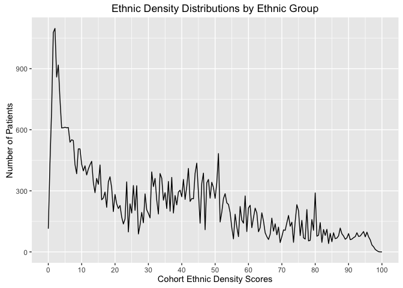
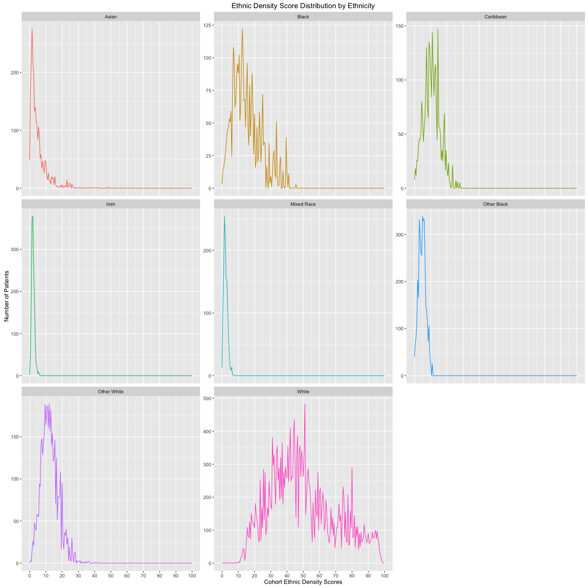
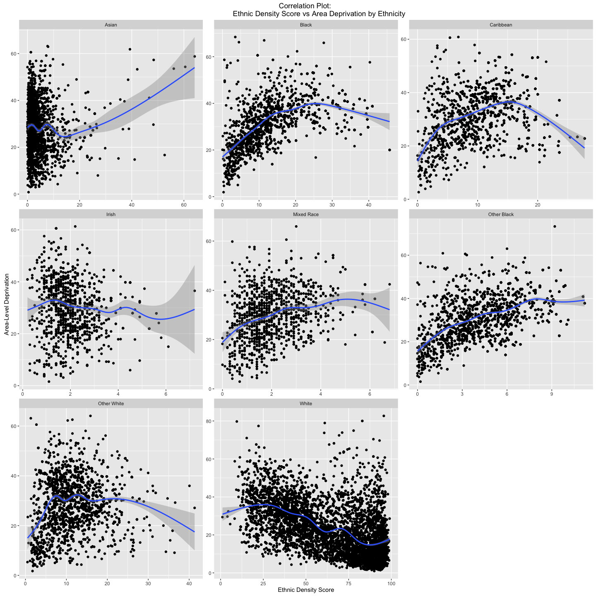
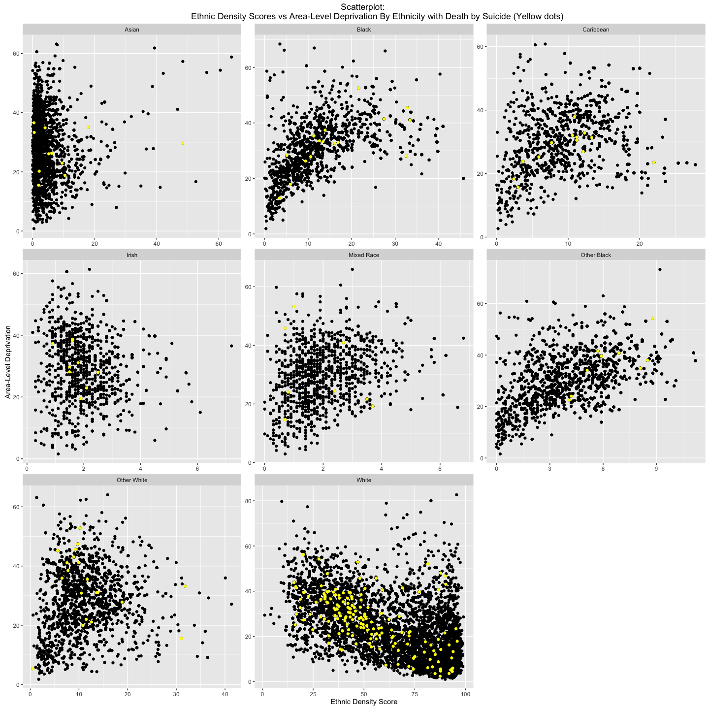
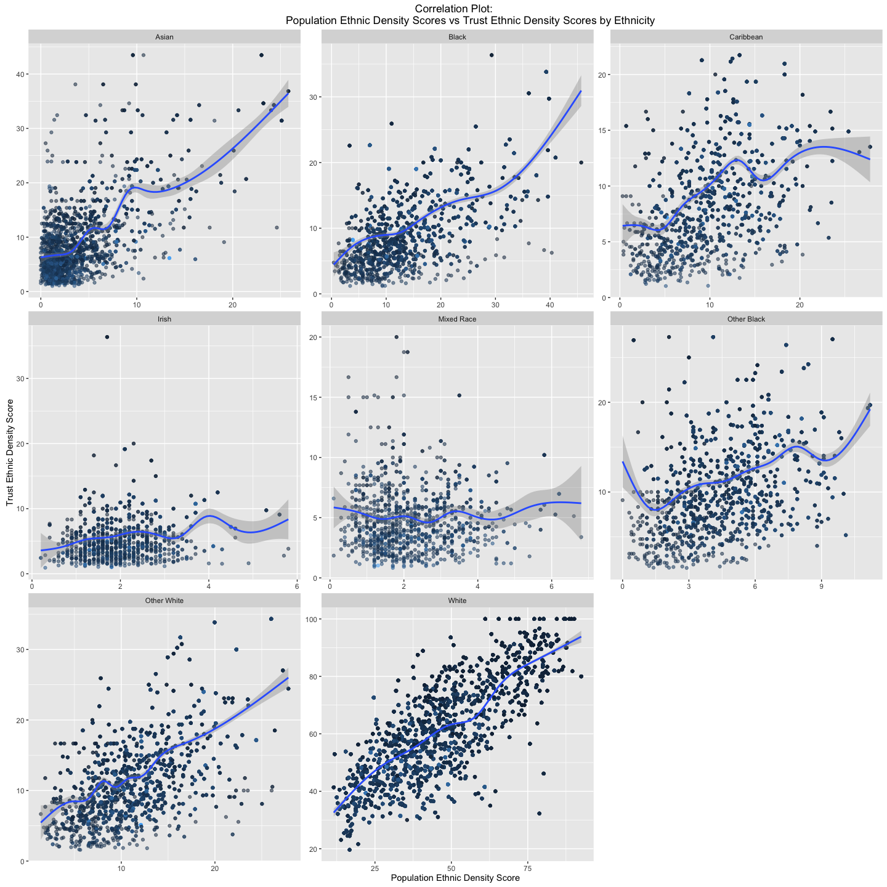
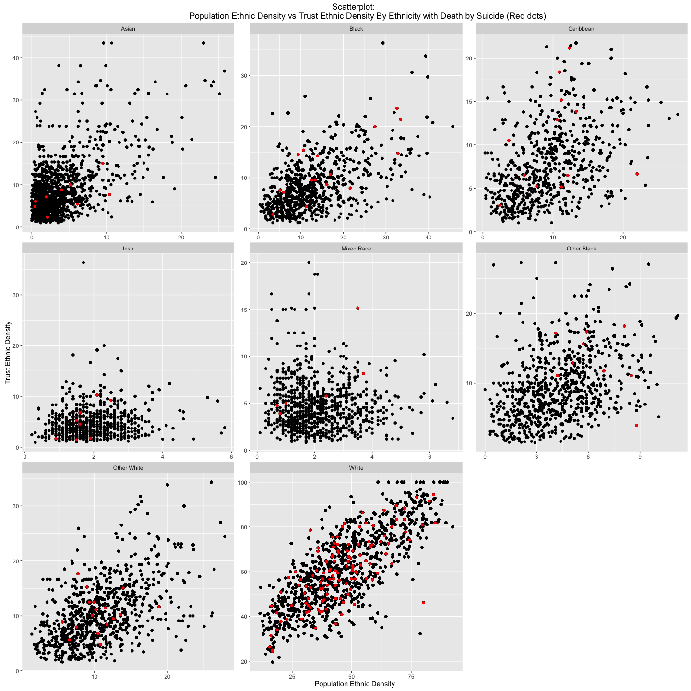
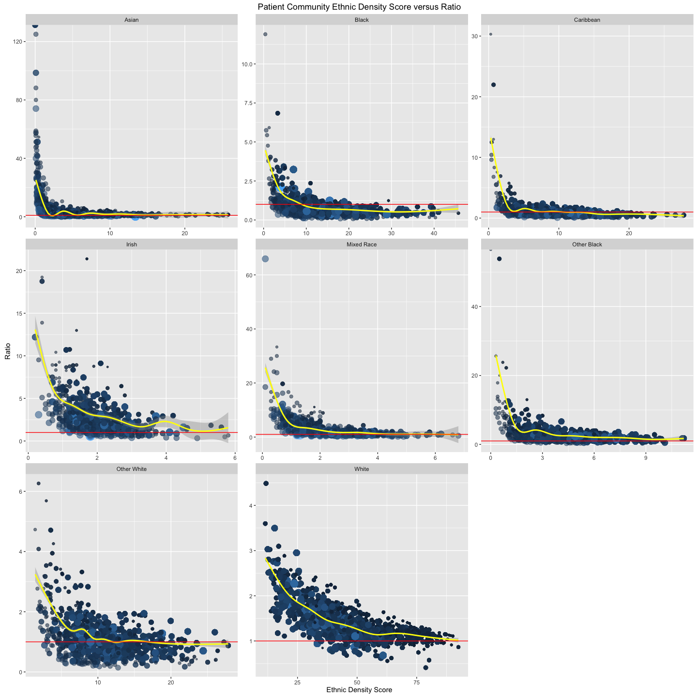
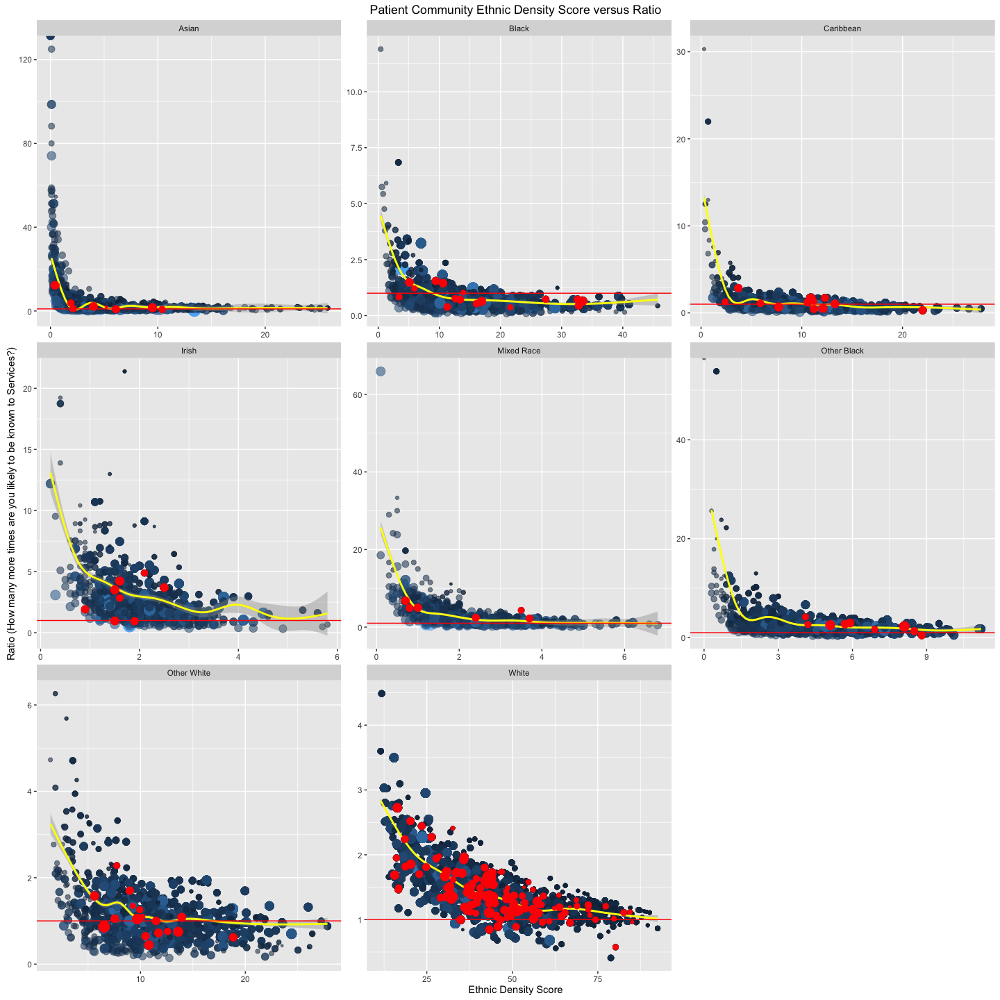

# Exploring the Data
Andrea Fernandes <andrea.c.fernandes1@gmail.com>  
22 June 2016  

*******

### Introduction

*******

In this section, ethnic density distribution and suicide are explored to help give any indication (visually) of whether ethnic density scores are associated / predict death by suicide in mental health. At the end of the document, based on the exploratory analysis, hypotheses are generated to analyse in the next section. 

******

### Exploring Ethnic Density and Death by Suicide

__Can we see patterns of deathy by suicide with ethnic density distributions?__

******

#### What does the ethnic density distribution look like?
<!-- -->

******

The most number of patients live in areas of low ethnic density areas. Is this reflected among all ethnic groups? 

******

#### Does the ethnic density distribution change with ethnic group?
<!-- -->

******

Yes, the ethnic density distributions are different in each ethnic group. Within this mental health care setting, the non-White British ethnic group tend to live in areas of lower ethnic density compared to the White British ethnic group. 

There are few ethnic groups whose ethnic distributions are limited to distributions below 10%. This will have to be considered in the final analysis. 

The table below shows the ethnic density mean score and standard deviation by ethnic group among death by suicide (1) vs non-suicides (0) and indicates which mean differences are significantly different. The Irish and the Other Black are the only two ethnic groups where the difference in ethnic density mean is significantly different. 

******

|ethnicity   |Suicide |      Mean|        S.D|     N|T-test                 |
|:-----------|:-------|---------:|----------:|-----:|----------------------:|
|Asian       |0       |  5.061238|  5.7740780|  2536|t = -1.10, df = 10, p-value = 0.296|
|Asian       |1       |  9.663636| 13.8316501|    11||
|Black       |0       | 15.210070|  8.9196143|  3277|-0.57, 15.1, 0.575|
|Black       |1       | 16.650000| 10.0434390|    16||
|Caribbean   |0       | 10.780671|  4.9713853|  2742|0.72, 12.1, 0.48|
|Caribbean   |1       |  9.715385|  5.2925807|    13||
|Irish       |0       |  2.079076|  0.8917008|  1558|2.45, 8.3, 0.038|
|Irish       |1       |  1.711111|  0.4456581|     9||
|Mixed Race  |0       |  2.185460|  1.1687715|  1293|0.54, 7.07, 0.603|
|Mixed Race  |1       |  1.937500|  1.2861210|     8||
|Other Black |0       |  4.814228|  2.2278974|  3739|-2.58, 8.05, 0.032|
|Other Black |1       |  6.366667|  1.7979155|     9||
|Other White |0       | 12.389223|  5.2981810|  4365|0.16, 19.08, 0.871|
|Other White |1       | 12.112080|  7.5515498|    20||
|White       |0       | 49.927589| 20.1629816| 27757|-1.39, 177, 0.165|
|White       |1       | 52.165909| 21.2804693|   176||

******

#### Does ethnic density vary with deprivation?

The literature suggests that among ethnic minorities, with increasing ethnic minority density the area deprivation also increases. Is this relationship reflected in this dataset? The figure below is a scatterplot of the ethnic density and area-level deprivation (by ethnicity) followed by the strength of the association (correlation). 

******

<!-- -->

The plots shows: 

- The correlation between ethnic density scores and deprivation, is different among different ethnic groups. 

In the line with the literature, the correlation table below lists, in order, the strength of correlation in each ethnic group:

- Deprivation and ethnic density scores are not correlated among the Asian, Irish and Other White ethnic groups.    

- There are weak, positive correlations with the deprivation and ethnic density scores among the Caribbean and Mixed Race groups.    

- There are positive moderate correlations among the Black and Other Black ethnic groups.     

- There is a moderate negative correlation between deprivation and ethnic density in the White British group.    

******

__Correlation Table: Deprivation and Ethnic Density Score by Ethnicity__

|      | Pearson's correlation value, p-value   |
|:---  |:---                     |
|Asian | -0.003, 0.874 |
|Other White | 0.08, < 0.05 |
|Irish | -0.11, < 0.05 |
|Caribbean | 0.27, < 0.05 |
|Mixed Race| 0.30, < 0.05 |
|Black| 0.50, < 0.05 |
|Other Black | 0.51, < 0.05 |
|White | -0.55, < 0.05 |

******

From intuition and support in the literature, it can be expected that patients who come from lower ethnic density areas and highly deprived areas, are more likely to die by suicide. 

This figure below plots ethnic density against deprivation and highlights deaths by suicide. 

******

#### Are there any noticeable patterns in the deaths by suicide by ethnic density and deprivation?

__Death by Suicide in the plot of Ethnic Density and Area-Level Deprivation __
<!-- -->

******

The plot above does not give any obvious indications of deaths by suicide occuring at the higher or lower spectrums of ethnic density scores or even deprivation for that matter. 

It looks like there may not be an association of ethnic density with completed suicide. However, given that they are so rare, analyses using a balanced dataset may reveal otherwise. 

******

### Comparing Population Ethnic Density with Trust Ethnic Density

******

__Patient ethnic density in the community (Population Ethnic Density Score) versus Patient ethnic density in the trust (Trust Ethnic Density Score)__ 

Ethnic density scores in the dataset are assigned to patients based on the percentage ethnic composition in the community they reside in. Whether these ethnic compositions are also reflected in the mental health trust can be evaluated. 

#### Defining Trust Ethnic Density

Like the original ethnic density score, which is defined as the composition of each ethnic group residing in a geographical area of a given size, the trust ethnic density is the percentage composition of each ethnic group in a given group of patients residing in the same LSOA code and who have been referred to the trust. Comparing the original ethnic density score (which will be referred to as the population ethnic density score) to the trust ethnic density score, can give an idea of whether being referred to mental health services can be explained in part by one's population ethnic density.

******

#### How does Population Ethnic Density Score compare with Trust Ethnic Density Score?

ref you could potentially add an image here??

<!-- -->

******

Population Ethnic density seems to be positively correlated (regardless of strength) in all the ethnic groups.

******

__Correlation Table: Trust Ethnic Density and Ethnic Density Score by Ethnicity__

|        | Pearson's correlation value, p-value |
|:------:|:------------------------------------:|
|Black | -0.05, < 0.05 |
|Caribbean | -0.05, < 0.05 |
|Irish | 0.016, < 0.51 |
|Other Black | -0.15, < 0.05 |
|Other White | 0.17, < 0.05 |
|Mixed Race | -0.24, < 0.05 |
|Asian | 0.35, < 0.05 |
|White | 0.76, < 0.05 |

The correlation tests show a strong positive correlation of trust ethnic density and population ethnic density among White British ethnic groups. In the rest of the ethnic groups there is a weak to no correlation of Trust ethnic density with population ethnic density. 

It could be expected (given suggestions from the literature) that deaths by suicide will occur more among those with low ethnic density (trust and population). The plot maps deaths by suicide in the scatterplot create above. Is there a pattern or cluster of deaths by suicide at the lower spectrum of ethnic density scores?

<!-- -->

******

There does not seem to be an obvious pattern that suggests any association of ethnic density and dying by suicide. The only plot that stands out is the Other Black ethnic category, where more suicides seem have occurred in higher ethnic density areas relative to lower ethnic density areas. 

********

#### Does trust ethnic density proportionately increase with community ethnic density? - The "ratio" variable

******

Using the "ratio" variable, how much more or less a patient's ethnic density is in the trust can be plotted against their ethnic density in the community, to determine whether patients are more (or less) likely to be represented in mental health trust relative to their representation in the community (i.e. population ethnic density). A "ratio" value of 1, means population ethnic density is reflected in the mental health care setting as well. Ratios higher than one indicate higher likelihood of being known to mental health services when population ethnic density is low. Ratios lower than one suggest that there is less chance of being known to services given high ethnic density in the community. 

The plot below is a shows the relationship between ratio and population ethnic density. 

<!-- -->

___The red line, in the plots above, indicates a ratio of 1 - the perfect proportionate representation. Points falling close to this point, indicate that patient's population ethnic density is also matched to trust ethnic density. The size of each point indicates the size of the area of residence they come from.___ 

******

Among all the ethnic groups, there is a recurring trend. This is that patients living in very low ethnic density areas have a very high ratio value. This indicates, that patients living in areas where there are very few of the own-group ethnicity residents, are very likely to be one of the people (from all the residents in the area) to be known to secondary mental health care services.  

The plot suggests that patients living in low ethnic density areas are sometimes the only ones from the entire community to be known to services, while those who live in areas of higher ethnic density are proportionately represented in the mental health trusts. 

Thinking about this further, this could be reflective of "an ethnic density effect". For individuals who do not live in areas where there are more individuals of the same ethnicity, the lack of ethnic density effect could contribute to experiencing mental health issues. Conversely, individuals with mental health problems may not reside in areas where there more of their own ethnicity due to stigma or access to mental health facilities. 

Again, from intuition and the literature it can be hypothesised that perhaps suicide may occur increasingly among patients who live in low ethnic density areas and who are more likely to be known to mental health services. The plot below overlays data points representing death by suicide. 

<!-- -->

The plots do not show any obvious clusters in death by suicide by ethnic density score or ratio. Apart from the Other Black category, where more suicides have occurred in relatively higher ethnic density areas compared to lower ethnic density areas.

******

### Suicide and patient characteristics

******

To conclude the exploratory data analysis, and to steer away from exploring ethnic density score (the main exposure variable), the following table explores the main outcome variable - death by suicide. The table shows which variables are significant in explaining any differences in deaths by suicide. 

|Suicide         |Non Suicides      | Suicides  | Significance      |
|:-------        |-----:            |--------:  |-----------------: |
|                | 47267            | 262       |                   |
|__Mean E.D.__   | 32.9(25.0)       | 38.2(27.0)|          < 0.05   |
|__Ethnicity__   |                  |           |                   |
|Asian           |  2536            |  11       |                   |
|Black           |  3277            |  16       |                   |
|Caribbean       |  2742            |  13       |                   |
|Irish           |  1558            |   9       |                   |
|Mixed Race      |  1293            |   8       |                   |
|Other Black     |  3739            |   9       |                   |
|Other White     |  4365            |  20       |                   |
|White           | 27757            | 176       |          0.11     |
|__Deprivation__ |  29.4(10.8)      | 28.5(11.3)|          0.21     |
|__Borough__     |                  |           |                   |
|CROYDON         | 10370            | 49        |                   |
|LAMBETH         |  9934            | 45        |                   |
|LEWSIHAM        |  8090            | 45        |                   |
|OTHER           |  9810            | 82        |                   |
|SOUTHWARK       |  9063            | 41        |          <0.001   |

******

### Exploring the data: Conclusions and considerations for analysis

From this exploratory analysis, there are few points to consider for the next phase of analysis. 

- Ethnic Density does not seem to be associated with death by suicide (except in the Other Black ethnic group however its ethnic density distribution is very limited). 

- There is evidence of an ___ethnic density effect___ on mental health service use, with patients living in areas of very low ethnic density are also the only individuals from their community to be known to services. 

- Suicide is a rare event (262 deaths out of ~47K patients) and to study the association a balanced dataset will be required. 

- Ethnic density does not seem to predict suicide in mental health but my be able to predict using mental health services. 

******

### Appendix

__Additional Feature Engineering__

Three new variables were generated - "LSOAsize", "trust.ed" and "ratio"

__Data Dictionary for new variables__

|Variable|       |
|:-------|:------|
|LSOAsize| The total number of patients within a given LSOA code |
|trust.ed| The percentage ethnic composition within a given LSOA code |
|ratio   | trust.ed divided by populaiton ethnic density score variable (ethnicdensityscore).Whether the ethnic density of a certain individual within the Trust is proportionate to the ethnic density of the individual in the community can be calculated using the `ratio` of Trust ethnic density to Population Ethnic Density |

