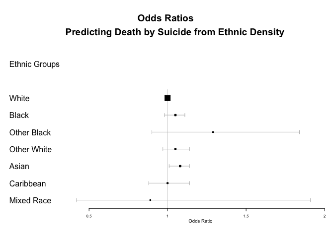

# Data Analysis: Ethnic Density and Death By Suicide
Andrea Fernandes <andrea.c.fernandes1@gmail.com>  
22 June 2016  


******

### Introduction

*******

In this document, the association of ethnic density scores with death by suicide is explored in each ethnic group, using the original "unbalanced" dataset and logistic regression analyses. The optimal model is selected based on the pseudo r^2 test (McFadden's test) and anova. 

Using a balanced dataset, the predictive power is then demonstrated to see if balancing the data improves the model. 

__Variables to Use__

- Age  
- Gender  
- Deprivation  
- Borough  
- Marital status  
- Ethnic Density Score    
- Suicide   
- Ethnicity  

 - Asian - 2547  
 - Black - 3293  
 - Caribbean - 2755  
 - Irish - 1567  
 - Mixed Race - 1301  
 - Other Black - 3748  
 - Other White - 4385   
 - White - 27933   


### Logistic regression analyses (using an unbalanced dataset)

******

__Analysing Suicide and Ethnic Density (unadjusted and fully adjusted)__

```r
#  Unadjusted model (Suicide and ethnic density only)
logistic_model_base <- tidy(glm(Suicide ~ ethnicdensityscore,
                      family="binomial",
                      data=dataset.white))

#  Fully adjusted model
logistic_model_full <- tidy(glm(Suicide ~ ethnicdensityscore + 
                                  Gender_Cleaned + ageatdiagnosis + 
                        Marital_Cleaned + imd_score + LSOA_4boroughs,
                      family="binomial",
                      data=dataset.white))
```


******

#### Results from the logistic regression analyses

******

|                     | Unadjusted Odds Ratio; Confidence intervals; significance |Adjusted Odds Ratio; Confidence intervals; significance|
|:--                  |:--------                                          | :--------                                     |
|__Ethnic Density Score__ | 1.01; 1.00 - 1.01;  0.143                         | 1.00; 0.99 - 1.01; 0.447                      |

******

- The logistic regression show no association of ethnic density score and suicide, in unadjusted analysis or the fully adjusted model.

******

__Comparing the two models (base and fully adjusted) using ANOVA and McFadden's test__


      The anova shows that there is significant difference among both models
      (p-value < 0.001).
      
      Model A - unadjusted model- McFadden's test : 9.93e-04
      Model B: - fully adjusted - McFadden's test : 0.017
      
      Neither of the models are good. 
      Both are very close to zero indicating that both are really 
      bad models, but model b (the fully adjusted model is better 
      than the base model)

#### Conclusion from the Logistic Regression Analysis

As expected, and indicated from the exploratory data analysis ethnic density is not associated with death by suicide.

******


### The association of Ethnic Density and Suicide in Different Ethnic Groups

Is there any association of ethnic density and suicide among different ethnic groups?

The same process above (unadjusted and fully adjusted analyses) was repeated for each of the ethnic groups. The following forest plot brings together the odds ratios from the analyses. See the respective .Rmd file for code. 

*******


  

<!-- -->

By ethnic groups as well, the ethnic density is not associated with death by suicide (apart from the Asian ethnic group).

******

### Predictive Modelling using a balanced dataset

******

To address the issue of unbalanced data and to assess how well the fully adjusted model can predict completed suicide, a generalised linear regression method was used to build a classification model using the R package `caret`. `SMOTE` is used to balance the data (http://search.r-project.org/library/performanceEstimation/html/smote.html). Model performance was assessed using area under the curve, sensitivity and specificity. 

      __Notes on Model Building using the Caret package__
      
      The code below uses functions (`trainControl` and `train`) in 
      the `caret` package to do the following:
      
            - The Model: Uses the full model (`as.factor(Suicide) ~
            ethnicdensityscore + Gender_Cleaned + ageatdiagnosis + 
            Marital_Cleaned + imd_score + LSOA_4boroughs`) to train 
            (using the `glm` method) a balanced data (using the `smote         
            function).
            
            - Balancing the dataset: using `SMOTE` as the sampling function, 
            which generates a balanced dataset, which means using equal numebers
            of cases and controls or over-sampling cases and under-sampling 
            controls to achieve a comparable numbers in both groups. 
            
            - Training and Testing: The training is performed using caret's 
            `trainControl` and `train` functions. It is set to use 5-fold
            repeated cross validation on the balanced dataset. The function is 
            set so that the training and testing process is repeated 100 times 
            on a 5-fold balanced dataset (4 sets for training, 1 set for 
            testing), with the performance of each model in predicting the 
            hold-out (testing) set being measured using selected performance 
            metric. 
            
            - The metric for assessing how well this model predicts completed
            Suicide is the Receiving Operator Curve (ROC). 


******

#### Results from predictive modelling

<!-- -->


|Ethnic Group  | Sensitivity |Specificity  | Positive Predictive Value|
|:------------:|:-----------:|:-----------:| :-----------------------:| 
|Other Black (light blue line) | 0.89 |   0.739   | 0.009  |
|Other White (yellow) | 0.55 |   0.72    | 0.009  |
|Mixed Race (blue line) | 0.75  |   0.64   |  0.019 |
|Caribbean (pink line)   | 0.46 |   0.65    |  0.0069|
|Asian (red line)       | 0.54|   0.74     |  0.0099|
|Black (orange line)      | 0.75  |   0.70   | 0.019  |
|White (black line)      | 0.37 |   0.76    |  0.01  |


      Definitions:
        
      Sensitivity: measures the proportion of positives that are correctly
      identified (i.e. of all the individuals who have died by suicide how many
      have been predicted correctly)
        
      Specificity: measures the proportion of negatives that are correctly
      identified (i.e. of all the individuals who have not died by suicide how
      many have been correctly predicted to have not died by suicide) 
        
      Positive Predictive Value: measures the proportion of predicted positives
      that are corrected identified (i.e. of all the predicted deaths by
      suicide, how many are correct)

****** 

#### Conclusion from Predictive modelling 

The table shows results from predictive analysis of a balanced dataset. While the sensitivity and specificity are good for some ethnic groups, the positive predictive values are poor across all ethnic groups, this means that suicides over-predicted and that the model cannot predict suicides accurately. 
