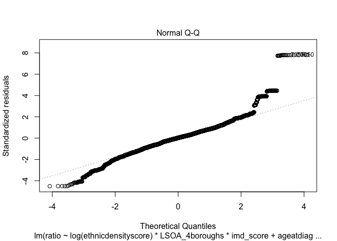

# Data Analysis: Patient Ethnic Density in the Community versus Patient Ethnic Density in the Trust
Andrea Fernandes <andrea.c.fernandes1@gmail.com>  
22 June 2016  


******

### Introduction

*******

In this document, the association of ethnic density scores with ratio is explored in each ethnic group, using linear regression analyses. The exploratory data analysis revealed a recurring trend among all ethnic groups. There seemed to a higher ratio of individuals known to mental health services if they were living in very low ethnic density areas. This part of the analysis allows to investigate if this association between low ethnic density and high ratio (indicative of being  known to services compared to all other residents) is significant. 

__Variables to Use__

- Age  
- Gender  
- Deprivation  
- Borough  
- Marital status  
- Ethnic Density Score    
- Ratio  
- Ethnicity  

 - Asian - 2547  
 - Black - 3293  
 - Caribbean - 2755  
 - Irish - 1567  
 - Mixed Race - 1301  
 - Other Black - 3748  
 - Other White - 4385   
 - White - 27933   

Note: this analysis will be conducted where the "LSOAsize" (for definition see ACFernandes.Capstone_Project_Data_Exploration.html) is greater than 9. I had conducted the analysis on the entire cohort initially but this introduces patterns in the residual plots that disappear when LSOAsize are above 10 and when analysing by ethnic groups. 

******

### Ratio and Ethnic Density

*******

__Reminder: Ratio Definition__

Using the "ratio" variable, how much more or less a patient's ethnic density is in the trust can be plotted against their ethnic density in the community, to determine whether patients are more (or less) likely to be represented in mental health trust relative to their representation in the community (i.e. population ethnic density). A "ratio" value of 1, means population ethnic density is reflected in the mental health care setting as well. Ratios higher than one indicate higher likelihood of being known to mental health services when population ethnic density is low. Ratios lower than one suggest that there is less chance of being known to services given high ethnic density in the community. 

******

### Linear Regression Analysis

******

#### Predicting Ratio with Ethnic Density in the White British group


- First Model  


```r
# Code for first model

ModelA <- lm(ratio ~ ethnicdensityscore + 
               LSOA_4boroughs + imd_score +
               ageatdiagnosis + Gender_Cleaned + 
               Marital_Cleaned, 
             data = subset(LSOAethnicdensity, 
                           LSOAsize > 9 &
                             ethnicity == "White"))

# summary(ModelA) 
# Multiple R-squared:  0.6457,	Adjusted R-squared:  0.6455 
```


 | Ethnicity |   OR  | Confidence Intervals  | p.value |
 | :---------|:------|:----------------------|:--------|
 | White     | 0.98  | 0.98 - 0.98           | < 0.001 |

 
 
******

Ethnic density, among the White ethnic group, seems to have almost no association with ratio (which is still significant). The models seems to be pretty good (R^2). 

To assess the model further, the diagnostic plots were plotted and an interaction tree was plotted to identify any potential interactions of the main explanatory variable with other variables. In addition, to account for the curvature in the association (see the figure below) a transformation of the main explanatory variable is attempted to assess modelling.  
 
 


******

__Diagnostic Plots__

<!-- --><!-- -->

The diagnostic plots reveal some non-randomness in the residuals. 

******

__Interaction Tree__

<!-- -->

The interaction tree shows how ethnic density is associated with ratio in the context of other variables included in the model. The most important explanatory variable is ethnic density score and the ethnic density threshold separating high and low values of ratio is ~40%. There may be some interaction of ethnic density with borough. From intuition, there may be some interaction between deprivation score and ethnic density, and this will be taken into account in the final model. 

******

- Updated Model  


```r
ModelB_withinteraction <- 
  lm(ratio ~ log(ethnicdensityscore)*LSOA_4boroughs*imd_score + 
             ageatdiagnosis + 
             Gender_Cleaned + Marital_Cleaned, 
             data = subset(LSOAethnicdensity, 
                           LSOAsize > 9 &
                             ethnicity == "White"))

# summary(ModelB_withinteraction) 
# Multiple R-squared:  0.7217,	Adjusted R-squared:  0.7214 

#------------------------------------------------------------------------------
# Accounting for interaction and transformation improves the model. The adjusted R^2 has improved. 
#------------------------------------------------------------------------------
```


Diagnostic plots of the new model
<!-- --><!-- -->


The model has improved slightly based on the R^2 and diagnostic plots. The association of ethnic density score with ratio is slightly almost null.


__How well does the model fit the data?__


*****

__Final Model__

The model fits really well to the data.

Model Selected to predict mental health service use (as represented by ratio) using ethnic density in the White British ethnic group is:

      ModelB_withinteraction <- 
        lm(ratio ~ log(ethnicdensityscore)*LSOA_4boroughs*imd_score + 
                   ageatdiagnosis + 
                   Gender_Cleaned + Marital_Cleaned, 
                   data = subset(LSOAethnicdensity, 
                                 LSOAsize > 9 &
                                   ethnicity == "White"))
                                   
                                   
                                   


******
#### Predicting Ratio with Ethnic Density in the Asian group

To demonstrate the more pronounced association of ethnic density and ratio (which was demonstrated in other ethnic groups), the Asian ethnic group is selected (analysis presented in this next section). 

******

- First Model  


```r
ModelA <- lm(ratio ~ ethnicdensityscore + 
               LSOA_4boroughs + imd_score +
               ageatdiagnosis + Gender_Cleaned + 
               Marital_Cleaned, 
             data = subset(LSOAethnicdensity, 
                           LSOAsize > 9 & 
                             ratio < 100 & 
                             ethnicity == "Asian"))

summary(ModelA) 
# Multiple R-squared:  0.1033,	Adjusted R-squared:  0.09872 
```


 | Ethnicity|   OR  | Confidence Intervals | p.value |
 | :--------|:------|:----------           |:--------|
 | Asian    | 0.62  | 0.57 - 0.66          | < 0.001 |
 
 
The model performs poorly (R^2 is ~0.1), however the regression analysis shows that the higher the ethnic density (among the Asian ethnic) the lower the ratio (i.e. being known to mental health services) - OR 0.62; 95% CI 0.57 - 0.66. This association is significant (< 0.001).

******

__Plotting the modelled line on the original data__


******

The plot models the data association well but does not fit the data at all. Diagnostic plots, interaction trees and transforming variables in the original model may help in making it a better fit model. 

******

__Diagnostic Plots__

<!-- --><!-- -->

The diagnostic plots reveals non-randomness in the residuals especially at the extreme values. 

******

__Interaction Tree__

<!-- -->


There may be a potential interaction between ethnic density scores and borough.

******

- Updated Model  


```r
ModelB_withinteraction <- 
  lm(log(ratio) ~ log(ethnicdensityscore)*LSOA_4boroughs + imd_score + 
             ageatdiagnosis + 
             Gender_Cleaned + Marital_Cleaned, 
             data = subset(LSOAethnicdensity, 
                            LSOAsize > 9 & 
                              ratio < 100 & 
                             ethnicity == "Asian"))

# summary(ModelB_withinteraction) 
# Multiple R-squared:  0.5793,	Adjusted R-squared:  0.5764 

#------------------------------------------------------------------------------
# Accounting for interaction and transformation improves the model. 
#------------------------------------------------------------------------------
```

******

Diagnostic plots of the new model
<!-- --><!-- -->


******

__Revised Odds Ratios__

The diagnostic plot for the revised model are much better (residuals are more random) and has increased the R^2 from 0.10 to 0.58. 

The odds ratio below shows that the ethnic density is very weakly associated with ratio. With every 1 unit increase in ethnic density score, there is a 3% decrease in ratio (being known to mental health services). 

 | Ethnicity|   OR  | Confidence Intervals | p.value |
 | :--------|:------|:----------           |:--------|
 | Asian    | 0.03  | 0.01 - 0.06          | < 0.001 |
 

*****

__Plotting the modelled line on the original data__
<!-- -->

This model fits the data much better but could be improved to show a more pronounced increase in ratio with low ethnic density score.

